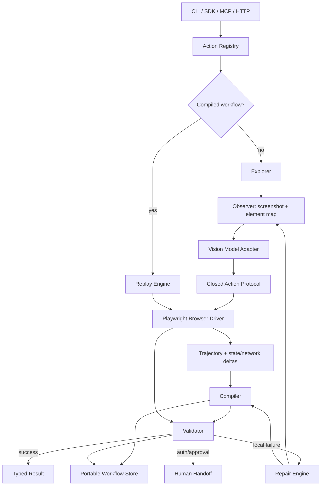

# Webpipe — Compiled Browser APIs

> **Working title:** `webpipe` is a placeholder; naming availability has not been assessed.  
> **Status:** Product and technical specification, draft v0.2  
> **Date:** 2026-08-30  
> **License target:** Apache-2.0

## Core pitch

**A tiny open-source library that converts arbitrary web interactions into self-healing callable APIs.**

The first call uses a vision model to understand and operate an unfamiliar website. Webpipe records the successful trajectory, compiles it into a deterministic workflow, validates it, and saves it as a named action. Later calls replay that action without a model. When the site changes, Webpipe repairs the smallest failed region and publishes a new workflow version.

```text
first call:   intent → vision exploration → successful run → compile → validate → save
later calls:  named action + inputs → deterministic replay → validate → typed result
on failure:   failed step → vision repair → patch → validate → version
```

The model is the **compiler and exception handler**, not the normal runtime.

---

## 1. Executive decisions

1. **Build from a clean slate.** Use Playwright as the browser substrate, but do not depend on Stagehand, Browser Use, Skyvern, or another browser-agent framework.
2. **Use TypeScript on Node.js.** This is the strongest intersection of browser automation, multimodal model adapters, MCP, JSON Schema, CLI distribution, and HTTP tooling.
3. **Start with Chromium.** Keep a browser-driver interface, but optimize the first release for one reliable target rather than weakly supporting three.
4. **Use hybrid perception by default.** Send the model a screenshot plus a compact map of visible interactive elements. Fall back to pure coordinates for canvas or unusual interfaces.
5. **Accept any instruction-following vision model through a tiny model contract.** Structured output and native tool calling are optional accelerators, not requirements.
6. **Make named actions the API boundary.** Do not use embeddings or vague semantic matching to decide which saved workflow should run.
7. **Make JSON Schema 2020-12 canonical.** The same input and output schemas drive SDK validation, CLI help, MCP tools, and generated OpenAPI.
8. **Store workflows as portable files.** Use readable, versioned JSON plus JSONL run logs. Do not require Postgres, Redis, or a hosted service.
9. **Never execute model-generated code.** The model may only return operations from a closed browser-action protocol.
10. **Require proof, not model confidence.** Deterministic postconditions and output validation decide success. A model saying “done” is insufficient for consequential actions.
11. **Keep authentication human-first.** A dedicated browser profile preserves login state. Passwords, passkeys, CAPTCHA, and push approvals should use human handoff rather than attempted circumvention.
12. **Expose one core through four thin surfaces:** TypeScript SDK, CLI, MCP server, and local HTTP/OpenAPI server.
13. **Defer automatic internal-API promotion until the UI compiler is reliable.** Record network traffic from day one, but only promote read-only workflows to direct HTTP after multiple validated demonstrations.
14. **Make browser identity explicit.** A profile owns a stable browser channel, locale, timezone, viewport, proxy identity, and storage state; do not silently change these between learning and replay.
15. **Add a first-class challenge broker.** Authentication expiry, CAPTCHA, passkeys, SMS, push approval, magic links, and ambiguous consent become resumable `input_required` states rather than generic execution failures.
16. **Add an effect journal.** Write and commit actions record prepared intent, observed remote evidence, and retry safety. An unknown commit outcome is never retried automatically.
17. **Keep browser infrastructure pluggable.** Local Playwright remains complete and default; generic remote-CDP and browser-extension modes are optional capability adapters, not core dependencies.
18. **Prefer secret references over secret storage.** Ship environment and command resolvers; integrate external vaults through optional adapters rather than building a credential manager.

---

## 2. Product thesis

Existing browser-agent tools optimize for completing the current task. Webpipe optimizes for making the **next thousand equivalent calls cheap, fast, inspectable, and deterministic**.

The durable output is not a prompt, selector, screenshot, or trajectory. It is a versioned action:

```text
supplier.invoice.get(invoice_id) -> Invoice
```

backed by progressively stronger implementations:

| Level | Runtime | Model use | Meaning |
|---|---|---:|---|
| L0 — Explored | Open-ended browser loop | Every step | The action is understood but not compiled |
| L1 — Compiled UI | Deterministic browser workflow | None on happy path | Inputs, locators, and output extraction are parameterized |
| L2 — Hardened UI | Locator bundles + assertions + variants | Repair only | Repeated success has produced robust fallbacks |
| L3 — Promoted HTTP | Browser-authenticated network call | None on happy path | The site’s internal request can safely replace UI navigation |

The primary product metric is therefore:

> **Validated zero-model replay rate**, not one-shot browser benchmark score.

### Core invariant

A stable action on an unchanged site must make **zero model calls**. If it still needs a model every time, it has not been fully compiled.

### Honest boundary

“Any website” means any website that a normal supported browser can access and that the user is authorized to automate. It does not promise reliable automation through hostile bot defenses, CAPTCHAs, hardware security keys, native applications, or every canvas-only interface.

---

## 3. Goals

### Product goals

- Turn one successful browser interaction into a reusable, parameterized action.
- Make repeat execution deterministic, typed, and model-free whenever possible.
- Repair broken workflows locally rather than rerunning the entire task agentically.
- Work locally with no required account, cloud browser, proprietary model, or telemetry.
- Support logged-in sites through isolated persistent profiles.
- Present the same action through SDK, CLI, MCP, and HTTP without duplicating logic.
- Produce artifacts that can be inspected, edited, diffed, tested, and committed to Git.
- Be pleasant for both humans and coding agents: stable JSON, schemas, exit codes, cancellation, and no mixed stdout logs.

### Technical goals

- Separate browser control, model inference, storage, policy, and interface adapters.
- Keep the model contract smaller than any provider SDK.
- Compile visual actions into resilient target bundles rather than single selectors.
- Attach explicit preconditions, postconditions, and output provenance to workflows.
- Record enough network evidence to support later UI-to-HTTP promotion.
- Preserve old workflow versions and allow instant rollback.
- Remain useful without a daemon; the SDK and CLI can run fully in-process.

---

## 4. Non-goals

The first public release is **not**:

- another general-purpose autonomous agent;
- a no-code RPA studio;
- a hosted browser fleet;
- a CAPTCHA-solving or anti-bot bypass product;
- a credential vault;
- a scheduler or workflow orchestration platform;
- an API crawler that automatically discovers every capability of a site;
- a system that silently chooses saved actions through semantic similarity;
- a way to evade access controls, rate limits, terms, or legal restrictions;
- a replacement for a first-party API when one is stable and available;
- a multi-user control plane, marketplace, billing system, or cloud service.

---

## 5. Product primitives

### Action

A named, typed capability exposed as a callable API.

```text
name: supplier.invoice.get
input:  { invoice_id: string }
output: { invoice_id: string, amount: number, file: FileRef }
effect: read
```

An action owns its intent, schemas, permissions, workflow versions, validation rules, and known site variants. It never contains login cookies or raw credentials.

### Run

One attempt to learn, replay, validate, or repair an action. Runs emit structured events and may retain permitted artifacts.

### Profile

A dedicated browser identity containing cookies and browser state for a site or account. Profiles live outside the project action directory and are never committed.

### Workflow

The compiled implementation of an action: a closed sequence of browser operations, targets, templates, checks, and output mappings.

### Variant

A workflow branch learned for a materially different page state, such as locale, account type, A/B layout, or mobile/desktop view. Variants are selected by explicit page signatures, not by model intuition.

### Target bundle

An ordered set of independently usable ways to resolve the same element:

```text
role + accessible name
label
placeholder
stable test id or attribute
text anchored within a section
relative structural selector
visual anchor
last-resort coordinates
```

### Effect class

Every action and step is classified as:

- `read`: observes, searches, extracts, or downloads;
- `write`: changes remote state but is ordinarily reversible;
- `commit`: sends, purchases, deletes, publishes, submits, transfers, or otherwise creates a high-impact or difficult-to-reverse effect.

---

## 6. Primary user experience

### Install and configure

```bash
npm install -g @webpipe/cli
webpipe setup
webpipe model doctor
```

`setup` installs or locates Chromium, creates the local data directory, and validates the configured model. It must not require a Webpipe account.

### Log in manually

```bash
webpipe login supplier \
  --url https://supplier.example.com
```

A headed, dedicated browser opens. The user completes login, 2FA, passkey, or CAPTCHA normally. Webpipe then reuses this profile until the session expires.

### Learn a named action

```bash
webpipe learn supplier.invoice.get \
  --profile supplier \
  --url https://supplier.example.com/invoices \
  --task 'Download invoice {{input.invoice_id}} and return its total' \
  --input-schema ./schemas/invoice-get.input.json \
  --output-schema ./schemas/invoice-get.output.json \
  --example '{"invoice_id":"INV-1234"}'
```

The first run:

1. explores the site with the configured vision model;
2. records observations, actions, selected elements, state changes, downloads, and relevant network events;
3. compiles the trajectory;
4. deterministically validates everything safe to replay;
5. stores a provisional or stable action version.

### Call it again

```bash
webpipe call supplier.invoice.get \
  --input '{"invoice_id":"INV-5678"}' \
  --json
```

Example stdout:

```json
{
  "ok": true,
  "action": "supplier.invoice.get",
  "run_id": "run_019...",
  "execution": "compiled_ui",
  "workflow_version": 3,
  "result": {
    "invoice_id": "INV-5678",
    "amount": 481.22,
    "file": {
      "path": "/Users/me/.webpipe/runs/run_019.../invoice.pdf",
      "media_type": "application/pdf",
      "sha256": "..."
    }
  }
}
```

No model is called unless replay or validation fails.

### Run an ad hoc task

```bash
webpipe run \
  --url https://example.com \
  --task 'Find the latest invoice total' \
  --output-schema ./schemas/total.json
```

Ad hoc runs may use a model throughout. They are **not** silently treated as durable APIs. The user can explicitly compile one:

```bash
webpipe compile <run-id> --as supplier.invoice.latest
```

### Inspect and manage

```bash
webpipe actions list
webpipe actions show supplier.invoice.get
webpipe runs show <run-id>
webpipe inspect <run-id>
webpipe action rollback supplier.invoice.get --to 2
webpipe action test supplier.invoice.get
webpipe action export supplier.invoice.get ./actions/
```

`inspect` should initially reuse Playwright trace viewing and local artifacts instead of introducing a custom web UI.

### Expose to agents and applications

```bash
webpipe mcp                     # stdio by default
webpipe serve --port 7331       # REST, OpenAPI, Streamable HTTP MCP
```

Both commands bind to loopback by default.

---

## 7. Public interfaces

All interfaces call the same in-process `Webpipe` core. They must share action schemas, policy checks, run records, errors, and result envelopes.

### 7.1 TypeScript SDK

```ts
import { createWebpipe } from "@webpipe/core";
import { playwrightBrowser } from "@webpipe/browser-playwright";
import { aiSdkVisionModel } from "@webpipe/model-ai-sdk";

const web = createWebpipe({
  browser: playwrightBrowser(),
  model: aiSdkVisionModel(myVisionModel),
  approvals: {
    read: "never",
    write: "first-run",
    commit: "always",
  },
});

await web.learn({
  name: "supplier.invoice.get",
  profile: "supplier",
  startUrl: "https://supplier.example.com/invoices",
  task: "Download invoice {{input.invoice_id}} and return its total",
  inputSchema,
  outputSchema,
  exampleInput: { invoice_id: "INV-1234" },
});

const run = await web.call(
  "supplier.invoice.get",
  { invoice_id: "INV-5678" },
  { signal: abortController.signal },
);

console.log(run.result);
```

Required SDK properties:

- full TypeScript inference when schemas are known;
- raw JSON Schema support without requiring Zod;
- `AbortSignal` cancellation;
- an async event stream for progress;
- in-process use with no HTTP server;
- dependency injection for browser, model, storage, policy, and secret resolution;
- stable structured errors.

### 7.2 CLI

The CLI must have two modes:

- human mode: concise progress, headed handoffs, helpful diagnostics;
- agent mode: `--json` or `--events`, stable output, no prompts, logs only on stderr.

Suggested exit codes:

| Code | Meaning |
|---:|---|
| 0 | Success |
| 2 | Invalid command or input schema failure |
| 3 | Authentication or human handoff required |
| 4 | Approval required |
| 5 | Workflow execution failed |
| 6 | Result or postcondition validation failed |
| 7 | Model adapter failed |
| 8 | Browser failed |
| 9 | Policy denied the action |
| 10 | Action or workflow version not found |

### 7.3 MCP

Stable compiled actions should appear as individual typed MCP tools. For example:

```text
supplier_invoice_get(invoice_id: string) -> Invoice
```

This is better than forcing an agent to call a generic `run(task: string)` tool because the model receives a narrow name, description, input schema, effect class, and output schema.

The MCP surface should also expose a small control set:

- `webpipe_actions_list`
- `webpipe_action_describe`
- `webpipe_run_get`
- `webpipe_run_cancel`

Open-ended exploration and learning tools must be disabled by default and enabled explicitly:

```bash
webpipe mcp --allow-explore --allow-learn
```

Use the official MCP TypeScript SDK v2. Support:

- stdio for local process-spawned clients;
- Streamable HTTP for remote/local daemon use;
- the MCP Tasks extension for long-running calls, progress, cancellation, and approval handoffs;
- structured tool results containing `result`, `run_id`, execution level, workflow version, and confidence state;
- tool-list change notifications when actions are added or removed.

### 7.4 HTTP and OpenAPI

The server should expose generic control endpoints and action-specific typed endpoints.

```text
GET  /v1/actions
GET  /v1/actions/{name}
POST /v1/actions/{name}/calls
GET  /v1/runs/{id}
POST /v1/runs/{id}/cancel
GET  /v1/runs/{id}/events
GET  /openapi.json
POST /mcp
```

For every stable action, generated OpenAPI should include a path whose request and response reference that action’s exact JSON Schemas. This allows conventional SDK generation without a Webpipe-specific client.

Calls may be synchronous for short replays or return a durable run handle. SSE provides progress for ordinary HTTP clients; MCP Tasks provides the equivalent MCP lifecycle.

Security defaults:

- bind to `127.0.0.1`, not `0.0.0.0`;
- require an explicit bearer token when exposed beyond loopback;
- validate `Origin` for HTTP MCP;
- never expose profile files or arbitrary filesystem paths.

---

## 8. Architecture



### 8.1 Core engine

Coordinates action resolution, policy, browser sessions, exploration, compilation, replay, repair, validation, result production, and run events. It must not know about CLI, MCP, or HTTP presentation.

### 8.2 Browser driver

A small internal interface covering:

- launch or connect;
- dedicated persistent profiles;
- pages, frames, screenshots, DOM and accessibility metadata;
- typed browser operations;
- downloads and uploads;
- request/response observation;
- tracing;
- storage state export/import;
- browser-authenticated HTTP requests;
- cancellation and cleanup.

The first implementation uses Playwright with Chromium. A remote CDP endpoint should work without a vendor SDK, allowing optional use of Browserless, Steel, Browserbase, or another compatible browser service.

### 8.3 Observer

Produces a model-efficient observation without trusting the page:

1. fixed-size viewport screenshot;
2. compact list of visible, actionable elements;
3. ephemeral element references mapped to live handles;
4. role, accessible name, label, text, bounds, frame, and selected stable attributes;
5. current URL, title, scroll position, open tabs, and recent state changes;
6. optional screenshot overlay showing element reference numbers;
7. cropped detail images when text or controls are too small;
8. no hidden page text unless specifically requested.

The overlay must be composited outside the page rather than injecting labels that could alter layout or event behavior.

### 8.4 Explorer

Runs the perception-action loop for a new task. It gives the model the external goal, trusted input values by symbolic reference, action history, policy boundaries, and current observation. It never gives the model shell, filesystem, arbitrary JavaScript, or raw network tools.

### 8.5 Compiler

Transforms a successful trajectory into a parameterized workflow. Compilation is deterministic wherever possible; the model may propose intent or assertions, but it does not generate executable code.

### 8.6 Replay engine

Executes the workflow’s closed operations, resolves locator fallbacks, enforces preconditions and effect boundaries, emits step events, and stops immediately when proof fails.

### 8.7 Validator

Determines whether steps and the overall action actually succeeded. It prioritizes deterministic evidence and treats visual-model judgment as a last resort.

### 8.8 Repair engine

Receives the failed step, its old target bundle, current observation, expected postcondition, and remaining goal. It attempts the smallest valid patch before escalating to open-ended exploration.

### 8.9 Action registry and storage

Resolves exact action names and versions, loads workflow variants, atomically publishes new versions, stores run metadata, and protects profiles with locks.

---

## 9. Vision-model compatibility

### 9.1 Minimum contract

Webpipe must not require a provider-specific tool-calling or structured-output API. The minimum interface is conceptually:

```ts
export interface VisionModel {
  readonly id: string;

  complete(request: {
    instructions: string;
    messages: Array<
      | { type: "text"; text: string }
      | { type: "image"; mediaType: string; data: Uint8Array }
    >;
    responseSchema?: JsonSchema;
    signal?: AbortSignal;
  }): Promise<{
    text: string;
    usage?: {
      inputTokens?: number;
      outputTokens?: number;
      costUsd?: number;
    };
  }>;
}
```

A compatible model must be able to:

- inspect screenshots;
- follow instructions;
- choose one operation from a small action vocabulary;
- reference an overlaid element number or normalized coordinate;
- return parseable text.

Native JSON Schema output, tool calls, image detail controls, and token accounting are optional capabilities.

“Any vision model” cannot honestly include models too weak to read the interface or follow the protocol. Webpipe should instead provide a transparent compatibility test and grade.

### 9.2 Model adapters

Ship four integration paths:

1. **SDK callback:** implement `VisionModel` directly.
2. **AI SDK adapter:** accept any compatible Vercel AI SDK model, including custom and OpenAI-compatible providers.
3. **OpenAI-compatible CLI configuration:** convenient local or remote endpoint support.
4. **Command adapter:** invoke an arbitrary executable over JSONL, allowing a model harness in Python, Rust, Go, or another process.

The command adapter is the strongest long-term decoupling mechanism. It should pass image file paths or bytes plus the requested response schema and receive a JSON response.

### 9.3 Model doctor

```bash
webpipe model doctor
```

The doctor opens a bundled local test site and measures:

- image ingestion;
- element-reference selection;
- normalized-coordinate accuracy;
- typing and dropdown selection;
- scroll behavior;
- JSON/protocol compliance;
- recovery after an invalid response;
- approximate action latency.

It saves a local capability profile and reports `compatible`, `limited`, or `incompatible`, with exact failures.

### 9.4 Closed action protocol

A model response may select only these high-level operations in the first release:

```text
click(element_ref | coordinate)
fill(element_ref, value_ref)
type(element_ref, value_ref)
press(key)
select(element_ref, option)
scroll(direction, amount)
navigate(url_ref)
wait(condition | duration)
extract(field_map)
download(element_ref)
done(result)
fail(reason)
request_human(reason)
```

Rules:

- Coordinates use a normalized `0..1000` space and are converted by the harness.
- Input values are referenced symbolically; secret values are never echoed into prompts.
- Arbitrary JavaScript, CSS execution, shell commands, and arbitrary HTTP requests are not valid model actions.
- Invalid output is parsed tolerantly, schema-checked, and repaired once with a text-only correction request before failing clearly.

---

## 10. Learning and compilation

### 10.1 Action identity comes first

Reliable compilation requires an explicit action name, task template, input schema, output schema, and example input. Webpipe should not infer an API contract from a vague repeated sentence unless the user asks it to.

```text
supplier.invoice.get
“Download invoice {{input.invoice_id}} and return its total”
```

This tells the compiler which values are parameters rather than constants.

### 10.2 Exploration trace

For each model action, record:

- observation ID and page signature;
- model request and parsed operation, subject to log policy;
- selected element reference or coordinate;
- exact live element reached;
- DOM/accessibility identity snapshot;
- browser operation performed;
- URL, DOM landmark, screenshot, download, and field-value deltas;
- network requests and responses within the correlation window;
- input symbols used;
- errors, retries, handoffs, and policy decisions.

### 10.3 Target compilation

When an action selects an element, the compiler should:

1. resolve the live element, including `elementsFromPoint` for coordinate actions;
2. collect tag, role, accessible name, label, text, placeholder, title, test IDs, stable attributes, ancestor landmarks, frame path, and bounds;
3. generate candidate Playwright locators;
4. test each candidate for uniqueness, visibility, actionability, and correct element identity;
5. reject volatile attributes such as generated hashes, long numeric IDs, changing classes, and session tokens;
6. score surviving candidates by semantic stability and locality;
7. save several independent candidates, not only the winner;
8. retain a visual anchor or coordinate only as a final fallback.

Playwright’s user-facing locator principles—role, label, text, and explicit test IDs—are the baseline. Webpipe adds multi-candidate scoring, state fingerprints, and visual fallback.

### 10.4 Parameter compilation

Only explicit symbols may become runtime parameters:

```text
{{input.invoice_id}}
{{secret.supplier_password}}
{{step.search.output.row_id}}
```

The expression language must be deliberately small:

- dotted object paths;
- string interpolation;
- equality, existence, URL match, text match, and numeric comparison predicates;
- no arbitrary JavaScript or template evaluation.

Secret resolution occurs only inside the executor. Secret plaintext must never enter the workflow file, run log, screenshot annotation, or model message.

### 10.5 Postcondition inference

A successful action is not enough; each compiled step needs evidence. Candidate postconditions are derived from state deltas:

- URL changed or matched a pattern;
- target became visible, hidden, enabled, disabled, checked, or selected;
- field value changed to the expected input;
- text or count changed;
- a download with allowed MIME type completed;
- a specific request completed with an acceptable status;
- output data validated against a schema.

The compiler may ask the model which observed delta is semantically meaningful, but the saved check must be deterministic whenever possible.

### 10.6 Output compilation

For each output field, prefer this source order:

1. downloaded structured file;
2. network response JSON;
3. DOM property, text, or attribute;
4. stable visual region with model extraction.

Fields that still require a model are marked `model_assisted`. The action records compile coverage:

```json
{
  "steps_deterministic": 8,
  "steps_total": 8,
  "output_fields_deterministic": 3,
  "output_fields_total": 3,
  "zero_model_replay_eligible": true
}
```

### 10.7 Safe verification

After compilation:

- Read-only workflows should replay immediately in a fresh context when safe.
- Reversible writes may replay only with explicit test data or user permission.
- Commit actions must not be duplicated merely to test the compiler.
- Side-effectful workflows remain `provisional` after one successful exploration and harden through later real calls.
- The compiler may replay up to, but not across, an explicit commit boundary.

Action confidence states:

```text
draft → provisional → stable → degraded → disabled
```

A read action may become stable after a clean exploration plus fresh replay. A write or commit action requires repeated independently validated calls or explicit author review.

---

## 11. Replay and repair

### 11.1 Replay algorithm

For each call:

1. resolve the exact action and requested or active workflow version;
2. validate input against JSON Schema;
3. acquire a profile lock;
4. launch or connect to the browser with the action’s viewport, locale, and profile;
5. check action-level preconditions and allowed origins;
6. execute each step using its highest-ranked valid target candidate;
7. verify the step postcondition;
8. extract and validate the result;
9. publish a run record and update workflow health;
10. release browser and profile resources.

A candidate is valid only if it uniquely resolves the intended element and satisfies its identity constraints. Webpipe must not blindly click the first selector match.

### 11.2 Repair ladder

On failure:

```text
retry same candidate if state is still loading
→ try next target candidate
→ refresh observation and re-resolve semantic candidate
→ invoke vision model for local step repair
→ resume open-ended exploration from current state
→ request human or fail
```

The repair prompt should include only:

- trusted external goal;
- current step and expected postcondition;
- old target identity and failure reason;
- current screenshot and visible element map;
- relevant successful history;
- remaining permitted operations.

It should not replay the entire conversation or ask the model to redesign a working prefix.

### 11.3 Patch publishing

A repair creates a candidate workflow version. It must:

- preserve the previous version;
- record exactly which step changed and why;
- revalidate the repaired suffix;
- avoid replacing a stable global workflow because of one temporary modal or A/B variant;
- create a page-signature variant when the new state is genuinely distinct;
- require review for changes at `commit` boundaries unless policy explicitly permits auto-patching.

### 11.4 Validation hierarchy

Use the cheapest and strongest proof available:

1. exact browser state or response invariant;
2. JSON Schema and semantic field constraints;
3. URL, DOM, accessibility, download, or network evidence;
4. comparison against prior stable page signatures;
5. independent visual-model judge as a last resort.

The same model that chose an action must not be the only source of truth for a consequential success claim.

---

## 12. Workflow intermediate representation

The canonical artifact is JSON validated against a versioned JSON Schema. YAML import/export may be added for humans, but JSON remains the source of truth.

Illustrative shape:

```json
{
  "format_version": "webpipe.dev/v1alpha1",
  "action": {
    "name": "supplier.invoice.get",
    "description": "Download one invoice and return its total",
    "effect": "read",
    "start_url": "https://supplier.example.com/invoices",
    "profile": "supplier",
    "allowed_origins": ["https://supplier.example.com"],
    "input_schema": {
      "$schema": "https://json-schema.org/draft/2020-12/schema",
      "type": "object",
      "properties": {
        "invoice_id": { "type": "string", "minLength": 1 }
      },
      "required": ["invoice_id"],
      "additionalProperties": false
    },
    "output_schema": {
      "$schema": "https://json-schema.org/draft/2020-12/schema",
      "type": "object",
      "properties": {
        "invoice_id": { "type": "string" },
        "amount": { "type": "number" },
        "file": { "$ref": "webpipe://schemas/file-ref" }
      },
      "required": ["invoice_id", "amount", "file"]
    }
  },
  "workflow": {
    "version": 3,
    "status": "stable",
    "execution_level": "compiled_ui",
    "page_signature": {
      "origin": "https://supplier.example.com",
      "path_pattern": "/invoices*",
      "landmarks": ["heading:Invoices", "textbox:Search"]
    },
    "steps": [
      {
        "id": "search_invoice",
        "op": "fill",
        "value": "{{input.invoice_id}}",
        "target": {
          "identity": { "role": "textbox", "name": "Search invoices" },
          "candidates": [
            { "kind": "role", "role": "textbox", "name": "Search invoices" },
            { "kind": "label", "value": "Invoice number" },
            { "kind": "placeholder", "value": "Search" }
          ]
        },
        "post": { "kind": "value_equals", "value": "{{input.invoice_id}}" },
        "timeout_ms": 10000
      },
      {
        "id": "open_invoice",
        "op": "click",
        "target": {
          "identity": { "role": "link", "name": "{{input.invoice_id}}" },
          "candidates": [
            { "kind": "role", "role": "link", "name": "{{input.invoice_id}}" },
            {
              "kind": "relative_text",
              "anchor": "{{input.invoice_id}}",
              "within": { "role": "row" }
            }
          ]
        },
        "post": { "kind": "url_matches", "value": "/invoices/*" },
        "timeout_ms": 15000
      },
      {
        "id": "download_pdf",
        "op": "download",
        "target": {
          "identity": { "role": "button", "name": "Download PDF" },
          "candidates": [
            { "kind": "role", "role": "button", "name": "Download PDF" },
            { "kind": "text", "value": "Download" }
          ]
        },
        "post": {
          "kind": "download",
          "media_types": ["application/pdf"],
          "max_bytes": 20000000
        }
      }
    ],
    "result": {
      "invoice_id": { "from": "input.invoice_id" },
      "amount": {
        "from": "dom",
        "target": { "kind": "text", "value": "Total" },
        "parse": "currency_number"
      },
      "file": { "from": "step.download_pdf.file" }
    }
  }
}
```

### IR rules

- Every format version has a published schema and migration path.
- Operations are declarative and closed.
- Every step declares its effect class; an action’s effect is at least the maximum step effect.
- Locator candidates are data, not executable code.
- All external values are symbolic references.
- Each output field records provenance.
- Arbitrary `eval`, JavaScript callbacks, and shell hooks are outside portable workflow files.
- Advanced users may wrap actions in SDK code, but generated MCP/OpenAPI only represents the portable core.

---

## 13. Cache and routing semantics

### Named action routing

`call("supplier.invoice.get", input)` resolves only that action. This is deterministic, auditable, and safe.

### Ad hoc convenience cache

For repeated freeform `run` requests, Webpipe may suggest an exact prior action using a canonical fingerprint:

```text
origin + normalized task template + input schema hash + output schema hash
+ locale + viewport class + profile capability scope
```

It must not automatically execute a semantically similar action with side effects. At most it may say:

```text
A compatible saved action exists: supplier.invoice.get. Use it? 
```

Agents running non-interactively receive the candidate ID and decide explicitly.

### Selector and variant cache

Individual locator success is tracked per page signature. Candidate rankings may adapt through observed success, but ranking changes are versioned when they affect stable behavior.

### No hidden global cache

All durable compilation artifacts are visible through `actions show` and stored locally. Provider-side prompt caching may reduce cost but is never treated as workflow compilation.

---

## 14. Authentication, profiles, secrets, and files

### 14.1 Dedicated browser profiles

Use a separate Chromium user-data directory per Webpipe profile. Never automate the user’s everyday default Chrome profile.

```text
~/.webpipe/profiles/supplier/chromium/
```

Requirements:

- one active writer per profile, enforced by a lock;
- strict filesystem permissions;
- headed login and session refresh;
- expiry detection returning `AUTH_REQUIRED` rather than guessing;
- profile metadata includes allowed origins and account label;
- action artifacts contain only a profile reference;
- optional storage-state export/import for compatible remote browsers.

The first release may rely on OS filesystem protection rather than claim portable profile encryption it cannot manage correctly. A later secret-store adapter can use platform keychains or an external vault.

### 14.2 Secrets

Support symbolic secrets through an injected resolver:

```ts
secretResolver.resolve("supplier_password")
```

The executor fills the resolved value directly into the target. The model sees only `{{secret.supplier_password}}`. Default CLI secret sources are environment variables and an optional command hook; Webpipe should not invent a weak home-grown vault.

### 14.3 Human handoff

`request_human` pauses a run with a reason and a browser-view URL or headed local window. Typical reasons:

- login expired;
- passkey or hardware key;
- CAPTCHA;
- SMS or push confirmation;
- approval at a commit boundary;
- ambiguous account or record selection.

SDK and CLI can wait interactively. HTTP returns a run in `input_required`. MCP uses the Tasks extension and its input lifecycle where supported.

### 14.4 Files

Use one stable `FileRef` representation:

```json
{
  "path": "/absolute/local/path/invoice.pdf",
  "media_type": "application/pdf",
  "size": 48291,
  "sha256": "...",
  "name": "invoice.pdf"
}
```

Rules:

- downloads go to the run artifact directory;
- enforce allowed MIME types and size limits before marking success;
- never auto-open downloaded files;
- sanitize filenames;
- use local paths in CLI/SDK and content handles or controlled download endpoints in remote HTTP mode;
- avoid embedding large files as base64 in normal JSON results.

---

## 15. Network observation and API promotion

This is the most valuable post-MVP compiler stage, but it must be conservative.

### Record from the beginning

During exploration and compiled UI runs, observe page and context request/response events, including XHR, fetch, and GraphQL traffic. Redact authorization headers, cookies, and configured sensitive fields before persistence.

### Candidate discovery

A UI step may produce a network candidate when:

- the request occurs within a tight interaction window;
- its initiator and response correspond to the requested effect;
- input symbols can be traced into URL, headers, or body;
- the response supplies fields used in the output;
- authentication can be reproduced through the browser context;
- no browser-only proof or challenge is required.

### Multiple demonstrations are required

One demonstration cannot reliably distinguish constants from parameters. Promotion should normally require at least two validated calls with differing inputs so Webpipe can diff:

- query and path parameters;
- JSON body locations;
- GraphQL variables and operation names;
- dynamic CSRF or anti-replay tokens;
- response field paths.

### Shadow validation

For read-only candidates:

1. execute the UI path normally;
2. execute the candidate request through the same browser context’s authenticated request client;
3. compare typed outputs and relevant side-effect evidence;
4. repeat across calls;
5. promote only after consistent equivalence.

### Mutation policy

Automatic HTTP promotion of writes and commit actions is disabled by default. It requires explicit opt-in, idempotency or duplicate detection, and stronger server-response validation.

### Fallback remains

A promoted HTTP action retains its hardened UI implementation. If the internal endpoint changes, Webpipe can fall back to UI, observe the new traffic, and propose a revised network adapter.

---

## 16. Security model

A browser agent operates on hostile content while holding authenticated state. Security is part of the core, not a later enterprise layer.

### Threats

- prompt injection rendered inside a webpage;
- secret or personal-data leakage through screenshots and model payloads;
- cross-origin navigation and data exfiltration;
- incorrect or duplicated side effects;
- malicious downloads;
- profile theft;
- a local HTTP/MCP server exposed to an untrusted network;
- arbitrary code generation or execution;
- an apparently successful action that did the wrong thing.

### Required defaults

1. **Treat page content as untrusted data.** Only the external caller supplies goals and policy.
2. **Closed operation set.** The model cannot run code, shell commands, filesystem operations, or arbitrary network calls.
3. **Origin manifest.** Every action lists allowed origins; cross-origin navigation is denied or requires explicit approval.
4. **Network restrictions.** Server deployments should support egress allowlists and OS/container isolation. Browser-library URL blocking alone is not a complete sandbox.
5. **Effect boundaries.** Read, write, and commit classes determine approval and repair policy.
6. **Commit approval.** High-impact final actions require human approval by default, even in an otherwise compiled workflow.
7. **No raw secrets in model context.** Use symbolic references and direct executor injection.
8. **Manual login by default.** Do not teach the model passwords or CAPTCHA workarounds.
9. **Local bind by default.** HTTP and MCP Streamable HTTP use loopback unless explicitly configured otherwise.
10. **No telemetry by default.** Diagnostics are local and opt-in.
11. **Minimal artifact retention.** Do not log raw model payloads, screenshots, DOM snapshots, or network bodies unless the configured retention policy permits it.
12. **Download quarantine.** Enforce type and size, hash files, and never execute them.
13. **Proof-based completion.** Consequential actions need independent deterministic evidence.
14. **Version and rollback.** A repair never destroys the last known-good workflow.
15. **Rate and concurrency limits.** One profile is serialized by default; action and origin limits prevent accidental loops.

### Data-egress clarity

Before the first model-assisted run on a profile, show or return:

```text
Model provider: <provider/model>
The model may receive screenshots from: supplier.example.com
Compiled replays will not contact the model unless repair is required.
```

Users who need full privacy can supply a local vision model through the same adapter contract.

### Known unsolved boundary

Prompt injection in visual interfaces cannot be completely eliminated. Webpipe reduces its authority through a closed action set, external goals, domain policy, symbolic secrets, and approvals; it must not claim perfect resistance.

---

## 17. Local storage and artifacts

Use a transparent filesystem layout first:

```text
project/
  webpipe.config.mjs
  .webpipe/
    actions/
      supplier.invoice.get/
        action.json
        workflows/
          0001.json
          0002.json
          0003.json
        tests/
          examples.jsonl
    runs/                         # optional project-local mode

~/.webpipe/
  profiles/
    supplier/
      profile.json
      chromium/
  runs/
    2026-08-30/
      run_019.../
        run.json
        events.jsonl
        downloads/
        screenshots/              # retention-policy dependent
        trace.zip                 # opt-in
  locks/
```

### Storage decisions

- Action and workflow files are JSON for deterministic parsing and portable diffs.
- Run events are append-only JSONL.
- Writes are atomic: temporary file, fsync where practical, then rename.
- Workflow publication uses monotonic local versions plus content hashes.
- File locks serialize profile access and workflow publication.
- No database is required for local use.
- Define a `StorageAdapter` from the start so a server deployment can later use SQLite, Postgres, or object storage without changing the engine.
- Do not add a database until real query, concurrency, or retention requirements justify it.

### Artifact retention modes

```text
none
errors
all
custom
```

Default to `errors` for screenshots and `none` for raw model payloads and response bodies. Traces are opt-in because they can contain sensitive DOM and network data.

---

## 18. Optimal implementation stack

### 18.1 Selected stack

| Layer | Choice | Why |
|---|---|---|
| Language/runtime | TypeScript, strict ESM, Node.js `>=22` | Best combined browser, AI-provider, MCP, schema, CLI, and server ecosystem |
| Browser | Playwright, Chromium first | Mature auto-waiting, contexts, auth state, locators, frames, downloads, network observation, tracing, and remote connection |
| Model abstraction | Webpipe-owned `VisionModel` interface | Keeps the core independent of model SDKs and structured-output requirements |
| Default model bridge | Vercel AI SDK adapter | Broad provider ecosystem, custom providers, OpenAI-compatible endpoints, images, and structured output where available |
| Cross-language model bridge | JSONL command adapter | Lets any external process or local model runtime participate without a TypeScript package |
| Schemas | JSON Schema 2020-12 | Language-neutral source of truth shared by MCP and OpenAPI |
| Validation | Ajv 8 in 2020-12 mode | Mature compiled JSON Schema validation |
| Screenshot processing | Sharp | Reliable resize, crop, format conversion, and non-invasive overlay composition |
| HTTP server | Fastify 5 | Small, fast, schema-oriented, mature lifecycle and plugins |
| REST description | OpenAPI 3.1 | Keeps action schemas standards-based and SDK-generatable |
| MCP | Official TypeScript SDK v2 | Current protocol support, stdio, Streamable HTTP, typed tools, Tasks extension path |
| CLI | Commander plus a very small prompt layer | Stable command parsing; human prompts can remain separate from agent JSON mode |
| Logging | Structured internal events; Pino only at server boundary | Avoid coupling core behavior to presentation while retaining useful server logs |
| Storage | JSON/JSONL files + atomic writes + locks | Portable, inspectable, Git-friendly, zero service dependency |
| Tests | Vitest + Playwright fixture sites | Fast unit tests plus realistic browser and mutation tests |
| Tooling | pnpm workspaces, Biome, TypeScript compiler, Changesets | Simple monorepo, consistent formatting, typed builds, controlled releases |
| License | Apache-2.0 | Permissive use with an explicit patent grant |

### 18.2 Why TypeScript, not Rust first

Rust would improve single-binary distribution, startup, and low-level safety. It would make the first version materially harder in the areas that determine product quality: Playwright integration, browser event coverage, multimodal providers, MCP, screenshot tooling, and fast iteration on schemas and prompts.

The correct boundary is an implementation-independent workflow format and small adapter protocols. A Rust replay engine or CLI can be added later without forcing the compiler to begin in Rust.

### 18.3 Why Playwright, not raw CDP

Raw CDP gives maximum Chromium control but would require rebuilding auto-waiting, locator semantics, frames, downloads, context isolation, tracing, and many edge cases. Playwright already exposes network traffic, persistent auth state, browser-authenticated request contexts, robust locators, and trace tooling. Webpipe should spend complexity on compilation and repair, not browser plumbing.

### 18.4 Why Chromium first despite Playwright cross-browser support

The hard use cases—persistent profiles, CDP attachment, service workers, internal API discovery, remote browser providers, and anti-automation differences—already vary by browser. Supporting Chromium well is a smaller and more honest MVP. The driver interface preserves a later WebKit or Firefox path.

### 18.5 Why hybrid perception, not pure vision

Pure vision is universal but expensive and imprecise. Pure DOM is fast but misses canvas, visual grouping, overlays, and interfaces whose semantics are poorly exposed. A screenshot plus visible element references gives an ordinary vision model spatial understanding while allowing deterministic element resolution and compilation.

### 18.6 Why JSON Schema, not Zod as the wire format

Zod is excellent inside TypeScript, but actions must also become MCP tools, OpenAPI endpoints, CLI contracts, files, and future non-TypeScript SDKs. JSON Schema 2020-12 is the neutral contract. The SDK may accept Zod or any Standard Schema implementation and convert it, but persisted artifacts should not depend on a TypeScript library.

### 18.7 Why files, not SQLite first

The expected first-use scale is tens or hundreds of local actions, not millions. Files make the compiler’s product visible and reviewable. SQLite becomes justified when a persistent daemon needs high concurrency, complex querying, distributed workers, or retention management. A storage interface keeps that migration cheap.

---

## 19. Alternatives considered

| Option | What it already does well | Why it is not the foundation |
|---|---|---|
| **Stagehand** | MIT-licensed AI actions, extraction, observation, deterministic replay, self-healing, and action caching; current versions expose TypeScript, Python, and Go APIs | Its unit is an AI-assisted browser action inside a broader SDK. Webpipe needs a portable named-action compiler, exact API schemas, its own model minimum contract, whole-trajectory compilation, versioned workflow IR, and later UI-to-HTTP promotion. Depending on Stagehand would couple the differentiating layer to another project’s action and cache semantics. |
| **Browser Use** | Strong open-source autonomous browser agent, model choice, browser profiles, and a large Python ecosystem | Optimizes agentic task completion. It is Python-led and does not make zero-model compilation into a typed callable API its central artifact. Useful benchmark and reference, not substrate. |
| **Magnitude browser-agent** | Apache-licensed, vision-first natural-language browser control and visual verification | Closest reference for model-agnostic visual interaction, but still centers runtime browser agency/testing rather than progressive compilation and API exposure. |
| **Skyvern** | Broad authenticated workflow platform with vision, deterministic actions, SDKs, workflow UI, and operations features | Much heavier than the intended library, Python/service-oriented, and AGPL-licensed. It solves platform-level workflow automation rather than a tiny portable compiler. |
| **Playwright MCP** | Official structured browser control for MCP agents using accessibility snapshots | Gives an existing agent hands. It does not learn a task, compile it, version it, or expose the learned capability as a new tool. |
| **agent-browser** | Fast Apache-licensed Rust CLI for browser actions and accessibility snapshots, with local and remote browser support | Attractive future browser-driver option, but its public abstraction is an agent command surface, not the deep trajectory/network/element compiler API required here. Raw Playwright gives more control initially. |
| **Steel / Browserless / Browserbase** | Local or hosted browser sessions, remote CDP, profiles, observability, proxies, and scaling | These are browser infrastructure. Webpipe should connect to them optionally through a browser endpoint, not make one mandatory. |
| **Puppeteer** | Focused Node browser automation with Chrome and improving Firefox/BiDi support | Good alternative, but Playwright provides the more complete high-level workflow, locator, context, trace, and cross-browser abstraction for this compiler. |
| **Selenium / WebDriver BiDi** | Standards-based cross-browser control and growing bidirectional network/event support | Best long-term protocol direction, but lower-level and less ergonomic for the first compiler. Keep the browser-driver boundary open as BiDi matures. |
| **Raw model-generated Playwright code** | Easy demo and flexible output | Unsafe, hard to validate, non-portable, difficult to patch structurally, and incompatible with weak models. Rejected. |

### Clean-slate conclusion

The market has good **browser agents**, good **AI-assisted action SDKs**, and good **browser infrastructure**. The underdeveloped layer is a small compiler whose durable output is a typed, inspectable, self-healing web API. That is narrow enough to justify a clean implementation.

---

## 20. Repository and package structure

Use a small monorepo internally while presenting one easy install path.

```text
webpipe/
  packages/
    core/                 # action engine, IR, compiler, replay, validation, policy
    browser-playwright/   # default Chromium implementation
    model-ai-sdk/         # optional AI SDK bridge
    model-command/        # JSONL subprocess bridge
    cli/                  # user and agent CLI
    mcp/                  # MCP adapter
    server/               # Fastify, REST, OpenAPI, HTTP MCP
  fixtures/
    sites/                # deterministic local benchmark sites and mutations
  schemas/
    action.schema.json
    workflow.schema.json
    run.schema.json
    file-ref.schema.json
  examples/
    minimal-sdk/
    local-model/
    authenticated-action/
  docs/
    concepts/
    security/
    adapters/
    workflow-format/
```

### Dependency direction

```text
core <- browser-playwright
core <- model adapters
core <- cli
core <- mcp
core <- server
```

`core` must not import Fastify, MCP, Playwright, AI SDK, or provider packages. It imports only its own interfaces, schema validator, and small utilities.

### Distribution

- `npm install webpipe` or scoped equivalent for the SDK/default runtime;
- `npm install -g @webpipe/cli` for the CLI;
- `npx webpipe ...` for trial use;
- an OCI image for server and CI use;
- no mandatory desktop app;
- a single native binary may be explored later, but must not delay the compiler.

---

## 21. Errors, events, and observability

### Stable error taxonomy

```text
INPUT_INVALID
ACTION_NOT_FOUND
WORKFLOW_NOT_FOUND
AUTH_REQUIRED
APPROVAL_REQUIRED
POLICY_DENIED
MODEL_INCOMPATIBLE
MODEL_FAILED
BROWSER_FAILED
TARGET_NOT_FOUND
TARGET_AMBIGUOUS
PRECONDITION_FAILED
POSTCONDITION_FAILED
OUTPUT_INVALID
DOWNLOAD_REJECTED
REPAIR_FAILED
CANCELLED
TIMEOUT
```

Errors include:

```json
{
  "code": "POSTCONDITION_FAILED",
  "message": "Expected invoice details page after opening INV-5678",
  "run_id": "run_019...",
  "step_id": "open_invoice",
  "recoverable": true,
  "handoff": null
}
```

### Run events

Emit an ordered event stream:

```text
run.started
profile.locked
browser.started
workflow.selected
step.started
step.target_resolved
step.completed
step.failed
repair.started
repair.completed
approval.required
auth.required
result.extracted
result.validated
workflow.version_published
run.completed
run.failed
```

Every surface maps these events without changing semantics.

### Metrics

Track locally per run and action:

- total latency and browser time;
- model calls, tokens, and reported cost;
- deterministic versus model-assisted steps;
- compile coverage;
- selector fallback depth;
- repair count and scope;
- validation failures and false-success investigations;
- workflow version and variant;
- execution level: explored, compiled UI, hardened UI, or HTTP;
- human handoffs;
- output provenance coverage.

OpenTelemetry export is a later optional adapter, not a required service.

---

## 22. Evaluation strategy

General browser-agent benchmarks measure first-run autonomy. Webpipe needs a compiler benchmark.

### Fixture suite

Build local sites whose behavior can be deterministically mutated:

- class and DOM nesting churn;
- text and label changes;
- reordered lists and tables;
- responsive layout changes;
- cookie and modal interruptions;
- A/B page variants;
- iframe and open shadow DOM controls;
- delayed loading and optimistic updates;
- infinite scroll;
- downloads and uploads;
- auth expiry;
- network endpoints whose shape changes;
- canvas-only controls;
- write and commit boundaries.

### End-to-end action classes

At minimum:

1. search and structured extraction;
2. authenticated invoice download;
3. form fill with reversible save;
4. multi-page table lookup;
5. file upload and result retrieval;
6. side-effectful submit with approval;
7. canvas interaction that remains model-assisted;
8. internal read API promotion after repeated demonstrations.

### Release metrics

Measure:

- first-run completion rate;
- compilation rate per step and output field;
- zero-model replay eligibility;
- replay success on unchanged sites;
- replay success after controlled mutations;
- local repair success and model calls required;
- false-success rate;
- median replay overhead above direct Playwright;
- action version churn;
- data leaked to logs or model messages in security tests;
- identical behavior across SDK, CLI, MCP, and HTTP.

### Initial release gates

- At least 95% successful replay on unchanged fixture actions after successful compilation.
- At least 90% of ordinary DOM-based steps compile to zero-model replay.
- At least 80% local repair success across the controlled selector/layout mutation suite.
- No known false success on commit-class fixtures.
- Identical schema validation and result envelope across all four interfaces.
- No secret plaintext in workflow files, event logs, or model payload fixtures.
- Cancellation reliably closes or releases browser resources.

These are engineering gates, not claims about every live site.

---

## 23. MVP scope

### Must ship

- TypeScript core and SDK;
- Playwright Chromium driver;
- generic `VisionModel` callback;
- AI SDK and command adapters;
- screenshot plus element-map observations;
- closed action protocol;
- named action definitions with JSON Schema inputs and outputs;
- vision exploration;
- trajectory recording;
- locator-bundle compilation;
- linear workflows with optional guarded steps;
- deterministic replay and postconditions;
- local step repair and workflow versioning;
- manual persistent-profile login;
- file downloads and structured DOM extraction;
- CLI with clean JSON mode;
- MCP typed tools over stdio;
- local Fastify server with REST, OpenAPI, and HTTP MCP;
- filesystem action store and JSONL run logs;
- effect classes and commit approvals;
- model doctor;
- local fixture benchmark suite;
- no telemetry.

### Explicitly deferred

- visual workflow builder;
- scheduling, queues, distributed workers, or teams;
- Postgres/Redis requirement;
- mobile/native desktop automation;
- Firefox and WebKit production support;
- CAPTCHA solving or stealth arms race;
- automatic semantic action dispatch;
- arbitrary branches and general programming constructs in the portable IR;
- automatic write/commit HTTP promotion;
- hosted marketplace or shared adapter registry;
- built-in password vault;
- custom inspector UI;
- Rust rewrite or single-binary packaging.

### First post-MVP priorities

1. network-candidate analysis and safe read-only HTTP promotion;
2. richer conditionals and bounded iteration;
3. remote browser endpoint adapters and profile portability;
4. workflow diff/review UX;
5. SQLite/server storage adapter;
6. Python and generated OpenAPI SDKs;
7. optional local inspector only where Playwright Trace Viewer is insufficient.

---

## 24. Build sequence

### Milestone A — deterministic kernel

- action, workflow, run, error, event, and storage schemas;
- browser-driver interface and Playwright implementation;
- fixed browser operations, profiles, downloads, tracing, and policy;
- SDK and CLI skeleton.

### Milestone B — universal vision loop

- observation builder and non-invasive overlays;
- minimal model contract;
- AI SDK, OpenAI-compatible, and command adapters;
- protocol parser and model doctor;
- ad hoc `run`.

### Milestone C — compiler

- live element identity capture;
- locator candidate generation and scoring;
- input parameterization;
- postcondition and output compilation;
- portable workflow publication;
- safe verification and confidence states.

### Milestone D — replay and repair

- target fallback and page signatures;
- local repair prompts;
- variants, versioning, rollback, and action tests;
- effect-aware patch policy.

### Milestone E — callable surfaces

- stable CLI JSON contract;
- typed MCP tools and Tasks support;
- Fastify REST/OpenAPI server;
- interface conformance tests.

### Milestone F — network compiler

- redacted traffic correlation;
- multi-demonstration diffing;
- browser-authenticated shadow requests;
- read-only promotion and UI fallback.

---

## 25. Product principles

1. **Compile intelligence away.** A good learned action gets cheaper and more deterministic with use.
2. **The artifact is the product.** Workflows must be inspectable, portable, testable, and versioned.
3. **Exact interfaces beat semantic guessing.** Names and schemas define APIs.
4. **Proof beats confidence.** A successful-looking screen is not enough.
5. **Repair locally.** Preserve known-good work and patch only what broke.
6. **Prefer open standards at boundaries.** JSON Schema, OpenAPI, MCP, JSONL, and CDP-compatible endpoints.
7. **Use semantics before pixels, pixels before failure.** Hybrid perception provides graceful degradation.
8. **No hidden cloud dependency.** Local execution is complete, not a demo mode.
9. **No model-generated code.** Keep runtime authority narrow and auditable.
10. **Do not fake universality.** Surface unsupported auth, bot defenses, weak models, and uncertain validation honestly.
11. **Keep the core small.** Browser fleets, schedulers, teams, UI builders, and marketplaces belong elsewhere.
12. **Make the safe path the easy path.** Dedicated profiles, exact actions, domain manifests, typed outputs, and commit approvals are defaults.

---

## 26. Key risks and mitigations

| Risk | Consequence | Mitigation |
|---|---|---|
| One successful run does not reveal a reusable parameterization | Brittle or incorrect compiled action | Require explicit task templates and schemas; harden across later calls |
| A site has many dynamic variants | Patch churn or wrong target | Page signatures, guarded optional steps, variants, and conservative publishing |
| Vision model protocol quality varies | Invalid or inaccurate actions | Element overlays, tiny action schema, tolerant parser, doctor, capability profile |
| A selector resolves but points to the wrong element | Dangerous false success | Identity constraints, uniqueness checks, postconditions, and result proof |
| Side effects cannot be replayed for validation | Provisional workflows remain uncertain | Commit boundaries, test inputs, repeated real-call hardening, explicit review |
| Prompt injection redirects the model | Data leakage or unintended actions | External goals, closed operations, origin policy, symbolic secrets, approvals |
| Screenshots contain sensitive data | Model-provider data exposure | Clear provider disclosure, local-model option, minimal model calls, retention controls |
| Internal API promotion duplicates mutations | Remote corruption | Read-only first, shadow calls, multi-run equivalence, explicit mutation opt-in |
| Browser ecosystem changes | Driver breakage | Playwright adapter boundary, pinned compatibility tests, automated fixture suite |
| Project expands into an RPA platform | Loss of minimality | Preserve strict non-goals and keep all interfaces as thin adapters over core |

---

## 27. Definition of success

Webpipe succeeds when this is ordinary:

```bash
webpipe learn crm.contact.lookup \
  --url https://legacy-crm.example.com \
  --task 'Find contact {{input.email}}' \
  --input-schema contact-lookup.input.json \
  --output-schema contact.json \
  --example '{"email":"first@example.com"}'

webpipe call crm.contact.lookup \
  --input '{"email":"second@example.com"}' \
  --json
```

The first command may be slow and intelligent. The second should behave like a normal API call:

- exact typed input;
- no model on the happy path;
- deterministic steps;
- validated structured output;
- clear provenance;
- repair only if needed;
- same capability callable from an agent through MCP and from software through HTTP or SDK.

That is the wedge: **not an AI that browses, but a compiler that turns browsing into software.**

---

## 28. Research basis

Primary project and standards references reviewed for this specification:

- [Playwright overview](https://playwright.dev/) — browser automation, Chromium/Firefox/WebKit, TypeScript/Python/.NET/Java, official MCP and CLI.
- [Playwright locators](https://playwright.dev/docs/locators) and [best practices](https://playwright.dev/docs/best-practices) — resilient role, text, label, and test-ID locator generation.
- [Playwright authentication](https://playwright.dev/docs/auth) and [BrowserContext API](https://playwright.dev/docs/api/class-browsercontext) — reusable authenticated browser state.
- [Playwright network](https://playwright.dev/docs/network) and [APIRequestContext](https://playwright.dev/docs/api/class-apirequestcontext) — request/response observation and browser-context HTTP calls.
- [Playwright tracing](https://playwright.dev/docs/api/class-tracing) and [Trace Viewer](https://playwright.dev/docs/trace-viewer) — screenshots, DOM snapshots, and network debugging.
- [Stagehand introduction](https://docs.stagehand.dev/v4/first-steps/introduction), [act](https://docs.stagehand.dev/v4/basics/act), and [action caching](https://docs.stagehand.dev/v4/best-practices/caching) — current AI action, replay, self-healing, and caching model.
- [Stagehand repository](https://github.com/browserbase/stagehand) — MIT license and current SDK scope.
- [Browser Use repository](https://github.com/browser-use/browser-use) — open-source autonomous browser agent, model flexibility, and profile handling.
- [Magnitude browser-agent repository](https://github.com/magnitudedev/browser-agent) — Apache-licensed vision-first browser control.
- [Skyvern repository](https://github.com/Skyvern-AI/skyvern) — broad vision workflow platform and AGPL-3.0 licensing.
- [agent-browser repository](https://github.com/vercel-labs/agent-browser) — Apache-licensed Rust browser CLI and accessibility snapshots.
- [Steel Browser repository](https://github.com/steel-dev/steel-browser) and [Browserless open-source deployment](https://docs.browserless.io/enterprise/open-source) — optional self-hosted browser infrastructure.
- [Puppeteer WebDriver BiDi](https://pptr.dev/webdriver-bidi) and [Selenium WebDriver BiDi](https://www.selenium.dev/documentation/webdriver/bidi/) — alternative browser-protocol direction.
- [MCP 2026-07-28 specification](https://modelcontextprotocol.io/specification/2026-07-28), [tools](https://modelcontextprotocol.io/specification/2026-07-28/server/tools), [transports](https://modelcontextprotocol.io/specification/2026-07-28/basic/transports), and [Tasks extension](https://modelcontextprotocol.io/extensions/tasks/overview) — typed agent tools and long-running execution.
- [MCP TypeScript SDK](https://ts.sdk.modelcontextprotocol.io/) — official server/client implementation and transports.
- [AI SDK providers and models](https://ai-sdk.dev/docs/foundations/providers-and-models), [custom providers](https://ai-sdk.dev/providers/community-providers/custom-providers), [prompts with image parts](https://ai-sdk.dev/docs/foundations/prompts), and [structured data](https://ai-sdk.dev/docs/ai-sdk-core/generating-structured-data) — optional multimodal provider bridge.
- [JSON Schema Draft 2020-12](https://json-schema.org/draft/2020-12) — canonical action schema format.
- [OpenAPI 3.1.1](https://spec.openapis.org/oas/v3.1.1.html) — generated HTTP API description.
- [Fastify validation and serialization](https://fastify.dev/docs/latest/Reference/Validation-and-Serialization/) — schema-oriented Node HTTP server.

---

## 29. Hard-problem architecture addendum

The difficult parts should be represented as explicit interfaces and states. They should not be hidden inside retries, prompts, or a specific cloud-browser vendor.

### 29.1 Browser runtime capability layer

Replace assumptions about one browser deployment with a capability-oriented `BrowserRuntime`:

```ts
export interface BrowserRuntime {
  readonly capabilities: {
    persistentProfile: boolean;
    portableStorageState: boolean;
    liveView: boolean;
    remoteControl: boolean;
    proxyIdentity: boolean;
    managedChallengeHandling: boolean;
    extensionAttach: boolean;
    virtualWebAuthn: boolean;
  };

  launch(request: BrowserLaunchRequest): Promise<BrowserSession>;
}
```

Initial implementations:

1. `local-playwright` — required and fully standalone.
2. `remote-cdp` — generic connection to any compatible remote browser.
3. `extension-attach` — later, explicitly authorized control of an existing user tab for difficult SSO, passkey, or extension-dependent sites.
4. Vendor adapters — optional packages only; never required by the core.

For local execution, prefer installed stable Google Chrome when available, using a dedicated non-default user-data directory. Fall back to the Playwright-managed Chromium build. A profile must retain one browser identity across login and replay: browser channel/version policy, headed/headless policy, locale, timezone, viewport, geolocation, and proxy affinity.

Do not make Patchright, Camoufox, a residential proxy, or a CAPTCHA service a default dependency. They can be experimental runtime adapters. The project should not claim that a patched browser makes hostile sites universally automatable.

### 29.2 Profile, identity, and authentication subsystem

A profile is more than cookies. It is the durable identity through which a site recognizes an account.

```ts
interface Profile {
  id: string;
  accountLabel?: string;
  allowedOrigins: string[];
  browserIdentity: BrowserIdentity;
  storageBackend: ProfileStoreRef;
  authProbe: AuthProbe;
  refreshAction?: ActionRef;
}
```

Required components:

- `ProfileStore` — local persistent directory, portable storage-state bundle, or remote context reference;
- `BrowserIdentity` — stable browser and network characteristics;
- `AuthProbe` — deterministic proof that the expected account is currently authenticated;
- `AuthRefresh` — optional compiled login/refresh workflow attempted at most once before handoff;
- `SecretResolver` — resolves symbolic values directly into fields without adding them to model context;
- `OneTimeCodeResolver` — optional trusted resolver for TOTP or another user-authorized one-time code source.

Supported auth strategies should be explicit:

| Strategy | Default handling |
|---|---|
| Existing authenticated profile | Reuse after `AuthProbe` succeeds |
| Username/password | Human login first; optional secret injection without model exposure |
| TOTP | Human by default; optional local/vault-backed resolver |
| SMS, push approval, magic link | Human or an explicitly installed least-privilege resolver |
| OAuth/device authorization | Prefer the provider's standard flow when exposed |
| Passkey, hardware key, enterprise SSO | Human handoff or explicitly authorized browser-extension mode |
| Session expiration | One safe refresh attempt, then `AUTH_REQUIRED` |

Never infer the current account from appearance alone. An authenticated action should be bound to an account label and prove it through a stable account identifier, profile page, API response, or other configured evidence.

### 29.3 Challenge broker

CAPTCHA and MFA are not ordinary browser errors. Introduce a durable `Challenge` object:

```ts
type ChallengeKind =
  | "login"
  | "captcha"
  | "totp"
  | "sms"
  | "push"
  | "magic_link"
  | "passkey"
  | "consent"
  | "account_choice"
  | "commit_approval"
  | "unknown";

interface Challenge {
  id: string;
  runId: string;
  kind: ChallengeKind;
  safeSummary: string;
  expiresAt?: string;
  allowedResolvers: string[];
  resumeToken: string;
}
```

Resolution order:

1. deterministic configured resolver;
2. local headed-browser handoff;
3. signed remote live-view handoff when the runtime supports it;
4. policy-approved runtime-managed challenge handling;
5. fail clearly without loops.

The open-source core ships `human` and `fail` resolvers. It may expose a generic provider capability for managed challenges, disabled by default. It should not integrate CAPTCHA farms, teach bypass techniques, or promise universal access.

A challenge pauses the run in `input_required`. Completing it resumes the same run; it does not create a new opaque agent attempt.

### 29.4 Durable run state machine

Human handoff can outlive the browser process. Runs therefore need persisted checkpoints, not merely a suspended JavaScript promise.

```text
created
  -> running
  -> input_required | approval_required
  -> resuming
  -> running
  -> succeeded | failed | cancelled | outcome_unknown
```

Checkpoint after every step that has a deterministic postcondition. A checkpoint records:

- workflow version and program counter;
- profile and browser identity lease;
- current origin, route signature, and page signature;
- completed outputs and evidence references;
- prepared or observed effects;
- unresolved challenge or approval;
- safe restart strategy.

On resume, Webpipe must re-prove the checkpoint preconditions. It must not assume the old page or browser process still exists.

### 29.5 Effect journal and two-phase commit

Retries are safe for many reads. They are not inherently safe for sending a message, placing an order, transferring money, deleting data, or submitting a form.

Every `write` or `commit` action gets an append-only effect record:

```ts
interface EffectRecord {
  effectId: string;
  action: string;
  normalizedInputHash: string;
  account: string;
  status:
    | "prepared"
    | "approved"
    | "submitted"
    | "confirmed"
    | "rejected"
    | "outcome_unknown";
  remoteIdentifiers?: string[];
  evidence?: EvidenceRef[];
}
```

Commit protocol:

1. navigate and prepare everything before the irreversible boundary;
2. summarize the exact pending effect from deterministic page data;
3. obtain approval when policy requires it;
4. write `approved` to the effect journal;
5. perform the final interaction exactly once;
6. collect independent confirmation evidence and remote identifiers;
7. mark `confirmed` only when proof succeeds.

If the browser or network fails after submission and before confirmation, return `OUTCOME_UNKNOWN`. Do not automatically retry. A separate reconciliation action may inspect remote state and resolve the record.

The practical default is **at-most-once for commits**, not a false claim of exactly-once semantics.

### 29.6 Evidence model and taint tracking

A result needs provenance. Add an `Evidence` type that can reference:

- selected DOM/accessibility text and attributes;
- URL and navigation transitions;
- downloaded file hashes;
- network request/response field paths;
- before/after state deltas;
- remote object identifiers;
- visual crops only as a fallback.

Every output field should optionally point to its evidence. Assertions should consume evidence rather than relying on the model's narrative.

Track the origin of values:

```text
trusted caller input
secret reference
untrusted page content
model-produced interpretation
validated remote evidence
```

Untrusted page content may populate outputs, but it must never redefine the task, widen allowed origins, request secrets, or change policy. This lightweight taint model is a more useful prompt-injection defense than prompt wording alone.

### 29.7 Recommended optional adapters

These are escape hatches, not mandatory stack dependencies:

| Adapter | Purpose | Status |
|---|---|---|
| Installed Chrome runtime | Better compatibility with ordinary user environments | Ship early |
| Generic remote CDP | Cloud/self-hosted browser without vendor coupling | Ship early |
| 1Password CLI resolver | Secret references, passwords, and user-authorized OTP retrieval | Early optional package |
| Bitwarden Secrets Manager resolver | Open ecosystem and machine-scoped secret access | Early optional package |
| HashiCorp Vault resolver | Enterprise dynamic-secret and policy integration | Later optional package |
| Steel runtime | Apache-2.0 self-hosted sessions, state, proxies, and debugging | Reference adapter after core |
| Browserbase/Browserless adapters | Managed identity, live view, profiles, and challenge capabilities | Later optional packages |
| Browser extension attach mode | User-authorized reuse of real SSO/passkey/extension state | Post-MVP |
| Experimental alternate browser runtimes | Compatibility experiments only | Community-maintained where possible |

No optional adapter may change action semantics, bypass core policy, expose secrets to the model, or suppress evidence requirements.

---

## 30. Hard problems, ranked

The hard problems are not “how to click a button.” They are, in priority order:

### P0 — Semantic correctness

Prove that the requested real-world outcome occurred and that the structured result refers to the correct account, record, date, amount, or object. False success is more damaging than an obvious failure.

### P0 — Mutation safety and outcome ambiguity

Prevent duplicate messages, purchases, submissions, deletes, and transfers across retries, crashes, repairs, and timeouts. Correctly surface the case where the remote outcome cannot be determined.

### P0 — Authentication identity lifecycle

Maintain the right account, browser identity, network affinity, session state, expiry detection, refresh behavior, and human challenge path without exposing credentials to the model.

### P1 — Program synthesis from demonstrations

Turn one or more successful trajectories into a parameterized program with variables, selectors, loops, branches, guards, extraction, and assertions. One trace rarely proves which values are constants.

### P1 — State and variant explosion

Handle banners, modals, pagination, empty states, account types, locales, A/B layouts, iframes, tabs, dynamic ordering, and data-dependent branches without producing an unmaintainable workflow.

### P1 — Hostile and automation-resistant environments

Cope honestly with CAPTCHAs, fingerprinting, IP reputation, device binding, rate limits, browser-attestation requirements, and sites that intentionally reject automation. This cannot be solved universally by an open-source harness.

### P1 — Untrusted-page security

Prevent visual or textual prompt injection, cross-origin exfiltration, secret capture, malicious downloads, and policy manipulation while still allowing the model to understand the page.

### P2 — Weak-model compatibility

Make ordinary vision models usable despite inconsistent coordinate grounding, small-text reading, malformed structured output, latency, and different image limits. The harness can grade and assist models, but it cannot make every model capable.

### P2 — Durable handoff and concurrency

Resume after humans, browser crashes, remote session expiry, and process restarts while serializing one account identity and preserving clear ownership of each run.

### P2 — Safe UI-to-network promotion

Infer internal requests, dynamic tokens, CSRF rules, anti-replay fields, and response schemas without promoting a coincidental or unsafe request. Read-only promotion remains the first target.

---

## 31. Forced invariants

Webpipe should enforce these rather than merely recommend them:

1. No action becomes `stable` without deterministic postconditions and typed output validation.
2. No `commit` action retries automatically after its final effect boundary.
3. No unknown commit outcome is reported as ordinary failure or success; it is `OUTCOME_UNKNOWN`.
4. No raw secret, OTP seed, cookie, or authorization header enters model context or normal logs.
5. No profile runs concurrently unless the profile backend explicitly supports safe identity leasing.
6. No cross-origin navigation outside the action manifest occurs silently.
7. No CAPTCHA, passkey, hardware-key, SMS, push, or consent challenge is hidden inside repeated agent attempts.
8. No learned workflow is promoted from coordinates alone when semantic or structural evidence is available.
9. No direct internal-API promotion occurs from a single demonstration.
10. No write/commit workflow is self-modified and immediately executed past a commit boundary without approval.
11. No model-generated code, arbitrary JavaScript, shell command, or arbitrary HTTP request executes.
12. No “any website” marketing claim omits authorization, challenge, browser-attestation, or deliberate anti-automation limits.
13. A stable unchanged action makes zero model calls on its happy path.

---

## 32. Revised implementation priority

Build in this order:

1. deterministic workflow IR, replay, evidence, and validator;
2. run journal, checkpoints, stable error states, and effect journal;
3. profiles, identity leases, `AuthProbe`, and local human handoff;
4. generic vision exploration and compilation;
5. local repair constrained to pre-commit regions;
6. CLI and SDK;
7. MCP and HTTP surfaces;
8. generic remote-CDP and optional secret resolvers;
9. browser-extension attach mode and richer remote live view;
10. conservative read-only network promotion.

Do not spend the early project on CAPTCHA vendors, stealth patches, browser fleets, or a custom dashboard. The core research value is correctness-preserving compilation.

---

## 33. Additional research basis

- Playwright supports persistent browser contexts, branded Chrome channels, authenticated state, remote CDP connections, and current storage-state coverage for cookies, local storage, IndexedDB, and virtual WebAuthn credentials. Its authentication documentation notes that `sessionStorage` needs separate handling.
- Chrome requires remote debugging to use a non-default user-data directory, reinforcing the dedicated-profile design.
- Playwright's browser-extension mode demonstrates the value of explicitly authorized reuse of an existing authenticated browser for SSO, 2FA, installed extensions, and existing tabs.
- Browserbase documents the operational pattern of manual live-view login, persistent contexts, stable identity, and human takeover for 2FA and CAPTCHA.
- Steel Browser is Apache-2.0 and provides an optional self-hostable session/browser API with state, proxy, and debugging primitives.
- 1Password CLI supports symbolic secret references and least-privilege service-account access; Bitwarden Secrets Manager and HashiCorp Vault provide alternative machine-oriented secret backends.
- RFC 6238 defines TOTP. RFC 8628 defines the OAuth device authorization flow. These should be consumed through explicit auth resolvers rather than improvised by the vision model.

